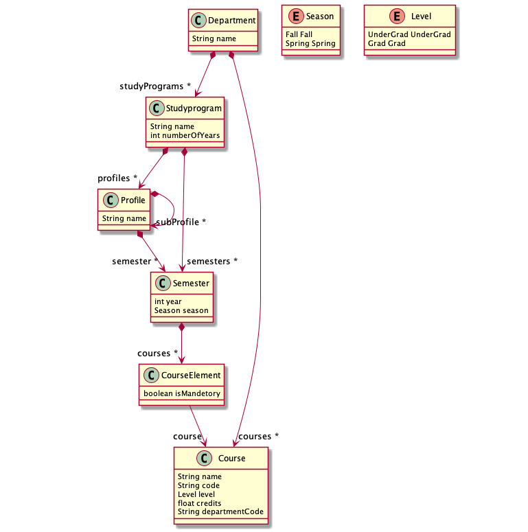
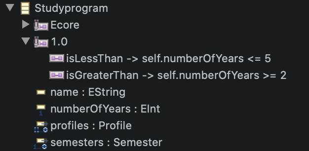
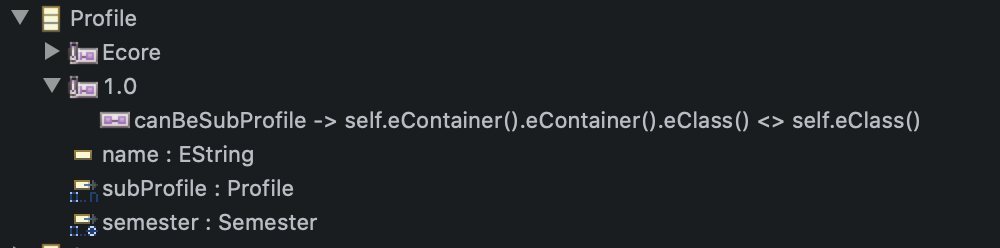
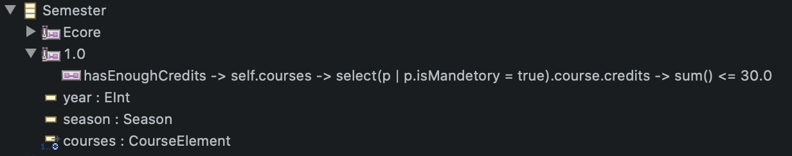

# Assignment 1 
## Model


### Classes
* Department: The root element, containing many study programs and courses
* StudyProgram: A spesific program to choose, it contains many semesters and can have a profile / spesialization
* Profile: A profile contains semesters and can have sub-profiles
* Semester: A semesters has attributes for which year in studyplan it is, what season and has a list of courseElements. 
* CourseElement: This is used to represent if a course is mandetory for this semester.
* Course: Holds information about the course, like name, code, credits and the level. Also has departmentCode, see derrived features

### Datatypes (Enums) 
* Level: If acourse is under graduate / batchelor level or graduate/masters level
* Season: Used to tell which season the seamester is, either fall or spring


## Constraints

### AQL 
#### Validate numbers of years a study program can be


#### Validate that there cannot exist any sub-sub profiles


#### Validate that a semester cannot have more than 30 credits of mandetory courses



### Manual Written Constraints 

#### Validate the format of a course code
A course can either be on format AA1234 or AAA1234. This checks if the formats is correct.
```
public boolean validateCourse_correctCourseCode(Course course, DiagnosticChain diagnostics, Map<Object, Object> context) {
	String code = course.getCode();
	
	if(code.length()< 6 || code.length() >7) {
		return false;
	}
	for(int i = 0; i < course.getCode().length(); i ++) {
		if(i < 3 && code.length() == 7) {
			if(!Character.isLetter(course.getCode().charAt(i))) {
				return false;
			}
		}else if(i < 2 && code.length() == 6){
			if(!Character.isLetter(course.getCode().charAt(i))) {
				return false;
			}
		}else {
			if(!Character.isDigit(course.getCode().charAt(i))) {
				return false;
			}		
		}
	}
	return true;
}
```

#### Validate correct credit
A course has to be a postiv number less than or equal to 60 credits. 
```
public boolean validateCourse_correctCredits(Course course, DiagnosticChain diagnostics, Map<Object, Object> context) {
	return course.getCredits() >= 0.0f && course.getCredits() <= 60.0f;
}
```

## Derrived Features
Course contains a departmentCode which is the first two or three letters in the course code (e.g. TDT in TDT4250) 


## Resource example
To simplify the model i only created one department and connected all the courses to this. Ideally I should have modelled University as the root, then faculty and institutes. 

