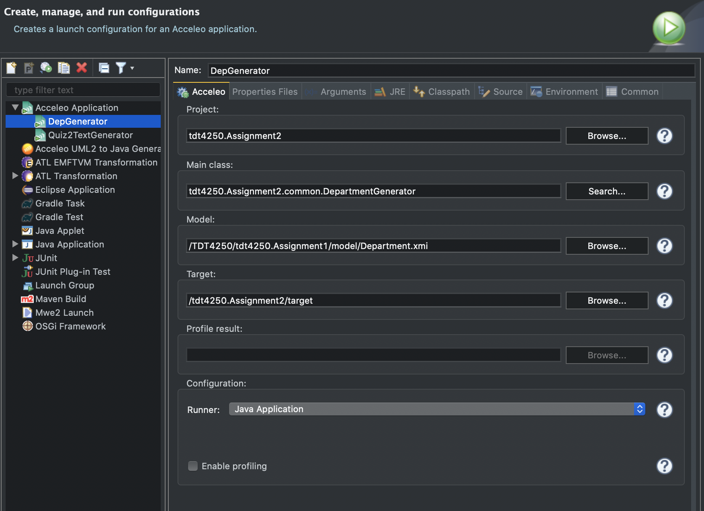

# Assignment 2 - Transforming a model instance
The goal of assignment 2 is to get experience with transformations. The task is to implement a transformation from (an instance of) the model from assignment 1 to a web page corresponding to the study program pages. I've chosen to implement a model to text (M2T) transformation, by turning the department.xmi from assignment 1 into a html web page using Acceleo. The submission is based on the [Acceleo tutorial](https://wiki.eclipse.org/Acceleo/Getting_Started).

## Setup
How to setup the project. 
1. Open  **`Assignment2.src.tdt4250.Assignment2.common`**
2. Right click on **`DepartmentGenerator.mtl`** and select "Run As ➡️ Run Configurations".
3. Set the configuration like the image below.

4. Click "Apply" and "Run"
5. Now you can find the generated HTML file in the **target** folder